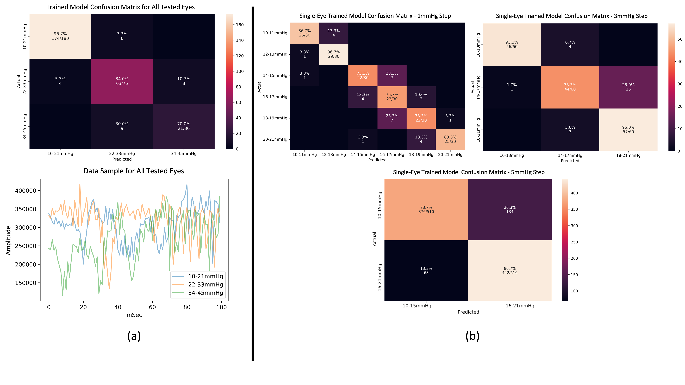

# iop-pigeye-speckle
Remote and low-cost intraocular pressure monitoring by deep learning of speckle patterns paper - python implementation

### Abstract
Intraocular pressure (IOP) measurements comprise an essential tool in modern medicine for the early diagnosis of glaucoma, the second leading cause of human blindness. The world's highest prevalence of glaucoma is in low-income countries. 
Current diagnostic methods require experience in running expensive equipment, as well as the use of anesthetic eye drops. We present herein a remote photonic IOP biomonitoring method based on the deep learning of secondary speckle patterns reflected from eye sclera stimulated by an external sound wave and captured by a fast camera. By combining speckle pattern analysis with deep learning, high precision measurements are possible.
The method was tested by artificially raising eye pressures of 24 pig eyeballs, found to be similar to human eyes. As a low-cost procedure, it has the potential to meet clinical needs in low- and middle-income countries and at points of care everywhere.

### Experimental Setup and Data Sample

### Model

### Results on test-set

